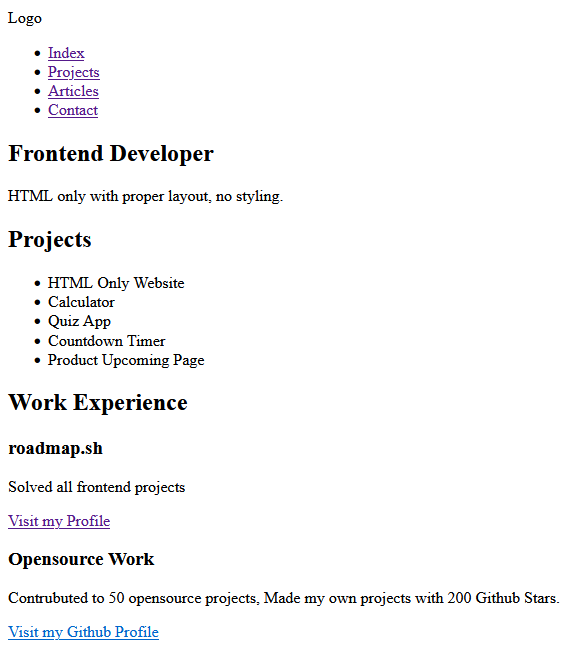
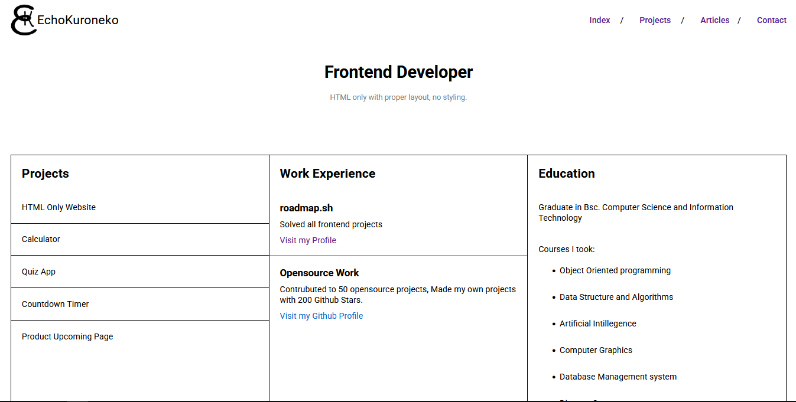
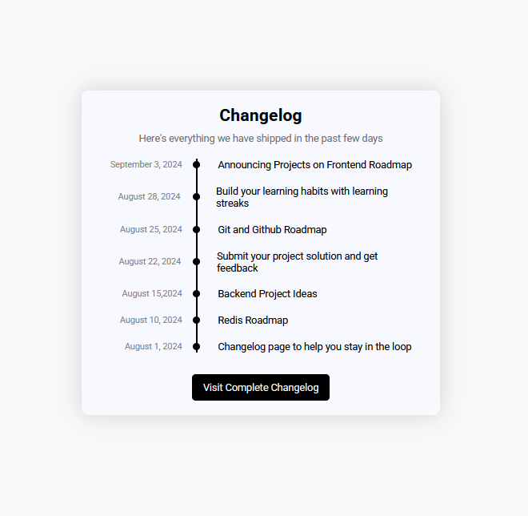

# Front-end Projects from Roadmap.sh

This contains frontend projects built following the [roadmap.sh](https://roadmap.sh/) [fronend developer path](https://roadmap.sh/frontend/projects).

## Projects List

- [Single Page CV](https://roadmap.sh/projects/single-page-cv) : [Live Demo](https://echokuroneko.github.io/roadmap.sh/Frontend-Projects/01-single-page-cv/)
- [Basic HTML Website](https://roadmap.sh/projects/basic-html-website) : [Live Demo](https://echokuroneko.github.io/roadmap.sh/Frontend-Projects/02-basic-html-website/)
- [Personal Portfolio](https://roadmap.sh/projects/portfolio-website) : [Live Demo](https://echokuroneko.github.io/roadmap.sh/Frontend-Projects/03-personal-portfolio/)
- [Changelog Component](https://roadmap.sh/projects/changelog-component) : [Live Demo](https://echokuroneko.github.io/roadmap.sh/Frontend-Projects/04-changelog-component/)

## Project Overview

  
  

  
  

